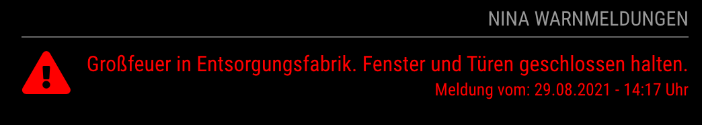
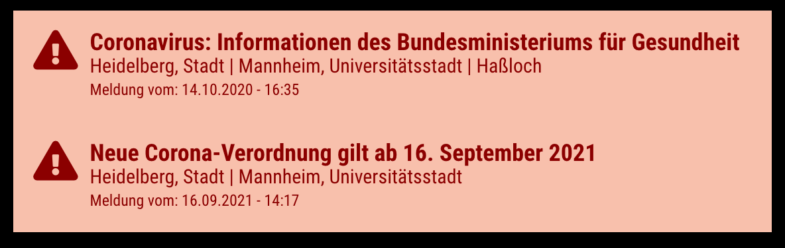

# MMM-NINA

[](https://github.com/jalibu/MMM-NINA/releases) [](https://snyk.io/test/github/jalibu/MMM-NINA?targetFile=package.json)

Eine simple Client Implementierung der [NINA Warn App API](https://nina.api.bund.dev/) für die [MagicMirror²](https://magicmirror.builders/) Plattform.  
Klicke hier für den [Forum Thread](https://forum.magicmirror.builders/topic/15429/mmm-nina).

Feedback und Mithilfe willkommen.

## Support

Wenn du meine Arbeit schätzt, dann freue ich mich über einen bescheidenen Beitrag zu meinem nächsten [Feierabend-Bier](https://paypal.me/jalibu).

## Features

- Das Modul ruft periodisch die NINA API auf und ermittelt Warnmeldungen für deinen Kreis.
  
- Es können Alarme mehrerer Städte/Gemeinden gleichzeitig abgerufen werden.
- Identische Warnungen können zusammengefasst werden.
  
- 2 unterschiedliche Themes

## Installation

1. Navigiere in das `MagicMirror/modules` Verzeichnis und führe folgendes Kommando aus, um das Projekt auf deine Festplatte zu klonen:

   ```bash
   git clone https://github.com/jalibu/MMM-NINA
   ```

2. Ermittle den amtlichen Gemeindeschlüssel deines Ortes aus [dieser Liste](https://www.xrepository.de/api/xrepository/urn:de:bund:destatis:bevoelkerungsstatistik:schluessel:rs_2021-07-31/download/Regionalschl_ssel_2021-07-31.json).

3. Binde das Modul abschließend in die MagicMirror-Konfiguration `MagicMirror/config/config.js` ein (Beispiel Konfiguration).

   ```javascript
    {
        module: "MMM-NINA",
        position: "top_right",
        config: {
            ags: ["110000000000"], // Liste der Gemeinden, die abgefragt werden sollen
            downgradeLhpSeverity: false,
            downgradeCancelSeverity: true,
            hideCancelledWarnings: false,
            excludeProviders: [], // Mögliche Werte ["MOWAS", "DWD", "BIWAPP", "LHP"]
            maxAgeInHours: 6,
            maxWidth: "200px",
            mergeAlertsById: true,
            mergeAlertsByTitle: true,
            orderBySeverity: true,
            showIcon: true,
            showDate: true,
            showCity: true,
            showNoWarning: true,
            theme: "top", // Erlaubte Werte: top, top-floating, side
            updateIntervalInSeconds: 120,

        }
    }
   ```

## Update

Um das Modul zu aktualisieren, navigiere in das Modulverzeichnis und führe ein `git pull` aus:

```bash
cd ~/MagicMirror/modules/MMM-NINA
git pull
```

### Optionen

| Feld                    | Beschreibung                                                                                                                            | Default                     |
| ----------------------- | --------------------------------------------------------------------------------------------------------------------------------------- | --------------------------- |
| ags                     | (Liste von Strings) Amtliche(r) Gemeindeschlüssel (AGS)<br>**Wichtig**: Werte unbedingt als String mit führenden Nullen angeben!        | `["110000000000"]` (Berlin) |
| downgradeLhpSeverity    | (Boolean) Reduziert die Severity von Meldungen des `Länderübergreifenden Hochwasser Portals (LHP)` auf "Minor"                          | `false`                     |
| downgradeCancelSeverity | (Boolean) Aufgehobene Warnungen sollen grün dargestellt werden und nicht in ihrer ursprünglichen Severity.                              | `true`                      |
| excludeProviders        | (Liste von Strings) Liste von Providern, dessen Meldungen nicht angezeigt werden sollen. Provider sind: "MOWAS", "DWD", "BIWAPP", "LHP" | `[]` (kein Filter)          |
| hideCancelledWarnings   | (Boolean) Verstecke aufgehobene Warnungen                                                                                               | `false`                     |
| maxAgeInHours           | (Integer) Maximales Alter der Warnmeldungen in Stunden, bevor sie ausgefiltert werden                                                   | `6`                         |
| maxWidth                | (String) CSS Style für maximale Breite des Moduls, z.B. `220px`. Weg lassen, zum Deaktivieren.                                          | `undefined` (deaktiviert)   |
| mergeAlerts             | _Veraltet_. Bitte stattdessen **mergeAlertsById** verwenden.                                                                            | `-`                         |
| mergeAlertsById         | (Boolean) Sofern Alerts für mehrere Gemeinden abgefragt werden, wird versucht gleiche Meldungen zusammenzufassen                        | `true`                      |
| mergeAlertsByTitle      | (Boolean) Sofern Alerts mit gleichem Titel vorliegen, wird versucht die Meldungen zusammenzufassen                                      | `true`                      |
| orderBySeverity         | (Boolean) Sollen Warnmeldungen absteigend nach ihrem Schweregrad angezeigt werden?                                                      | `true`                      |
| showCity                | (Boolean) Soll der Name der Gemeinde angezeigt werden?                                                                                  | `true`                      |
| showDate                | (Boolean) Soll das Datum der Meldung angezeigt werden?                                                                                  | `true`                      |
| showIcon                | (Boolean) Soll ein Warn-Symbol vor den Warnungen angezeigt werden?                                                                      | `true`                      |
| showNoWarning           | (Boolean) Lässt eine Meldung "Keine Warnungen" erscheinen, falls keine Ereignisse vorliegen.                                            | `false`                     |
| updateIntervalInSeconds | (Integer) Abstand in Sekunden, in dem Warnmeldungen vom NINA Server abgerufen werden                                                    | `120` (2 Minuten)           |
| theme                   | (String) Welches Theme soll angewendet werden?<br> Verfügbare Themes: `top`, `top-floating` und `side`                                  | `side`                      |

## Contribution and Development

This module is written in TypeScript and compiled with Rollup.
The source files are located in the `/src` folder.
Compile target files with `node --run build`.

Contribution for this module is welcome!

### Gemeindeschlüssel aktualisieren

**Hinweis:** Dieser Abschnitt ist für normale Nutzer nicht relevant. In größeren sollten die Gemeindeschlüssel jedoch aktuallisiert werden, um neue Gemeinden zu unterstützen.

Die Datei `src/backend/Regionalschluessel_2025-07-31.json` enthält alle deutschen Gemeinden mit ihren amtlichen Gemeindeschlüsseln (AGS). Diese Datei wird jährlich vom Statistischen Bundesamt aktualisiert.

Um die Datei zu aktualisieren:

1. Download der neuesten Version (ersetze `YYYY-MM-DD` mit dem aktuellen Datum, z.B. `2026-07-31`):

```bash
cd ~/MagicMirror/modules/MMM-NINA/src/backend
curl -s "https://www.xrepository.de/api/xrepository/urn:de:bund:destatis:bevoelkerungsstatistik:schluessel:rs_YYYY-MM-DD/download/Regionalschl_ssel_YYYY-MM-DD.json" -o Regionalschluessel_YYYY-MM-DD.json
```

2. Update des Imports in [src/backend/Utils.ts](src/backend/Utils.ts):

```typescript
// Ändere von:
import { daten } from './Regionalschluessel_2025-07-31.json'

// zu:
import { daten } from './Regionalschluessel_YYYY-MM-DD.json'
```

3. Formatiere die neue Datei mit Prettier:

```bash
cd ~/MagicMirror/modules/MMM-NINA
node --run lint:fix
```

Die neuesten Versionen sind verfügbar unter:

- [xrepository.de - Regionalschlüssel](https://www.xrepository.de/)
- [Statistisches Bundesamt](https://www.destatis.de/DE/Themen/Laender-Regionen/Regionales/Gemeindeverzeichnis/_inhalt.html)

## License

This project is licensed under the MIT License - see the [LICENSE](LICENSE.md) file for details.
