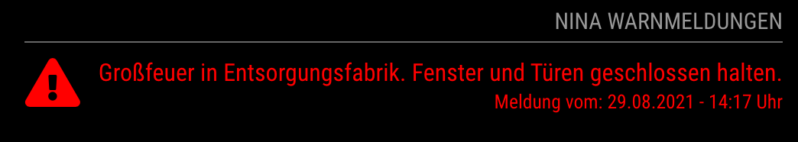
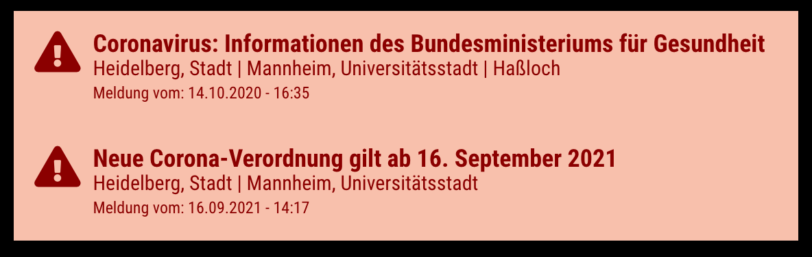

# MMM-NINA

[](https://github.com/jalibu/MMM-NINA/releases) [](https://snyk.io/test/github/jalibu/MMM-NINA?targetFile=package.json)

Eine simple Client Implementierung der [NINA Warn App API](https://nina.api.bund.dev/) für die [MagicMirror²](https://magicmirror.builders/) Plattform.
Klicke hier für den [Forum Thread](https://forum.magicmirror.builders/topic/15429/mmm-nina).

Feedback und Mithilfe willkommen.

## Support

Wenn du meine Arbeit schätzt, dann freue ich mich über einen bescheidenen Beitrag zu meinem nächsten [Feierabend-Bier](https://paypal.me/jalibu).

## Features

- Das Modul ruft periodisch die NINA API auf und ermittelt Warnmeldungen für deinen Kreis.
  
- Es können Alarme mehrerer Städte/Gemeinden gleichzeitig abgerufen werden.
- Identische Warnungen können zusammengefasst werden.
  
- 2 unterschiedliche Themes

## Installation

Navigiere in das `MagicMirror/modules` Verzeichnis und führe folgendes Kommando aus, um das Projekt auf deine Festplatte zu klonen:

```bash
git clone https://github.com/jalibu/MMM-NINA
```

## Update

Um das Modul zu aktualisieren, navigiere in das Modulverzeichnis und führe ein `git pull` aus:

```bash
cd ~/MagicMirror/modules/MMM-NINA
git pull
```

## Config

### Gemeindeschlüssel ermitteln

Ermittle zunächst den amtlichen Gemeindeschlüssel (AGS) deines Ortes:

- Über das [Gemeindeverzeichnis der Statistikämter](https://www.statistikportal.de/de/gemeindeverzeichnis) (einfach für manuelle Suche).
- Alternativ über die maschinenlesbare Liste von [xrepository.de](https://www.xrepository.de/api/xrepository/urn:de:bund:destatis:bevoelkerungsstatistik:schluessel:rs_2026-03-31/download/Regionalschl_ssel_2026-03-31.json).

### Konfigurationsbeispiel

Binde das Modul anschließend in die MagicMirror-Konfiguration `config/config.js` ein:

```js
    {
        module: "MMM-NINA",
        position: "top_right",
        config: {
            ags: ["110000000000"], // Liste der Gemeinden, die abgefragt werden sollen
            downgradeLhpSeverity: false,
            downgradeCancelSeverity: true,
            hideCancelledWarnings: false,
            excludeProviders: [], // Mögliche Werte ["MOWAS", "DWD", "BIWAPP", "LHP"]
            maxAgeInHours: 6,
            maxWidth: "200px",
            mergeAlertsById: true,
            mergeAlertsByTitle: true,
            orderBySeverity: true,
            showIcon: true,
            showDate: true,
            showCity: true,
            showNoWarning: true,
            theme: "top", // Erlaubte Werte: top, top-floating, side
            updateIntervalInSeconds: 120,
        }
    },
```

### Konfigurationsoptionen

| Option                    | Typ        | Default                     | Beschreibung                                                                                                                                  |
| ------------------------- | ---------- | --------------------------- | --------------------------------------------------------------------------------------------------------------------------------------------- |
| `ags`                     | `string[]` | `["110000000000"]` (Berlin) | **Erforderlich**<br>Amtlicher Gemeindeschlüssel/Regionalschlüssel (AGS), 12-stellig. Werte unbedingt als String mit führenden Nullen angeben! |
| `downgradeLhpSeverity`    | `boolean`  | `false`                     | **Optional**<br>Reduziert die Severity von Meldungen des Länderübergreifenden Hochwasser Portals (LHP) auf "Minor".                           |
| `downgradeCancelSeverity` | `boolean`  | `true`                      | **Optional**<br>Aufgehobene Warnungen werden grün dargestellt und nicht in ihrer ursprünglichen Severity.                                     |
| `excludeProviders`        | `string[]` | `[]` (kein Filter)          | **Optional**<br>Liste von Providern, dessen Meldungen nicht angezeigt werden sollen. Mögliche Werte: `MOWAS`, `DWD`, `BIWAPP`, `LHP`.         |
| `hideCancelledWarnings`   | `boolean`  | `false`                     | **Optional**<br>Versteckt aufgehobene Warnungen.                                                                                              |
| `maxAgeInHours`           | `number`   | `6`                         | **Optional**<br>Maximales Alter der Warnmeldungen in Stunden, bevor sie ausgefiltert werden.                                                  |
| `maxWidth`                | `string`   | `undefined` (deaktiviert)   | **Optional**<br>CSS Style für maximale Breite des Moduls, z. B. `"220px"`. Weglassen, um zu deaktivieren.                                     |
| `mergeAlerts`             | `boolean`  | `-`                         | _Veraltet_. Bitte stattdessen `mergeAlertsById` verwenden.                                                                                    |
| `mergeAlertsById`         | `boolean`  | `true`                      | **Optional**<br>Fasst gleiche Meldungen zusammen, sofern Alerts für mehrere Gemeinden abgefragt werden.                                       |
| `mergeAlertsByTitle`      | `boolean`  | `true`                      | **Optional**<br>Fasst Meldungen mit gleichem Titel zusammen.                                                                                  |
| `orderBySeverity`         | `boolean`  | `true`                      | **Optional**<br>Zeigt Warnmeldungen absteigend nach ihrem Schweregrad an.                                                                     |
| `showCity`                | `boolean`  | `true`                      | **Optional**<br>Zeigt den Namen der Gemeinde an.                                                                                              |
| `showDate`                | `boolean`  | `true`                      | **Optional**<br>Zeigt das Datum der Meldung an.                                                                                               |
| `showIcon`                | `boolean`  | `true`                      | **Optional**<br>Zeigt ein Warn-Symbol vor den Warnungen an.                                                                                   |
| `showNoWarning`           | `boolean`  | `false`                     | **Optional**<br>Zeigt die Meldung "Keine Warnungen" an, falls keine Ereignisse vorliegen.                                                     |
| `updateIntervalInSeconds` | `number`   | `120` (2 Minuten)           | **Optional**<br>Abstand in Sekunden, in dem Warnmeldungen vom NINA Server abgerufen werden.                                                   |
| `theme`                   | `string`   | `"side"`                    | **Optional**<br>Welches Theme angewendet werden soll. Verfügbare Themes: `top`, `top-floating`, `side`.                                       |

## Contribution and Development

This module is written in TypeScript and compiled with Rollup.
The source files are located in the `/src` folder.

Contribution for this module is welcome!

### Available Scripts

| Script                  | Purpose                                                                             |
| ----------------------- | ----------------------------------------------------------------------------------- |
| `node --run build`      | Production build (minified, optimized)                                              |
| `node --run dev`        | Development build with inline sourcemaps                                            |
| `node --run demo`       | Start MagicMirror with demo config (MM_CONFIG_FILE=modules/MMM-NINA/config.demo.js) |
| `node --run dev:watch`  | Watch mode for active development                                                   |
| `node --run test`       | Full quality check (TypeScript + ESLint + Prettier + Unit Tests)                    |
| `node --run test:unit`  | Run unit tests (Node test runner)                                                   |
| `node --run type-check` | TypeScript type validation only                                                     |
| `node --run lint`       | Check code style (ESLint + Prettier)                                                |
| `node --run lint:fix`   | Auto-fix code style issues                                                          |
| `node --run release`    | Create release (bumps version, updates CHANGELOG, creates git tag)                  |

**Development Workflow:**

```bash
# Start development with watch mode
node --run dev:watch

# Before committing, run full quality check
node --run test

# Auto-fix any linting/formatting issues
node --run lint:fix

# When ready for release
node --run release
```

**Git Hooks:**

Folgende Git Hooks sind automatisch aktiviert:

- **pre-commit**: Führt `node --run test` aus (verhindert untesteten Code)
- **pre-push**: Führt `node --run build` aus (verhindert nicht-kompilierten Code)

### Gemeindeschlüssel aktualisieren

**Hinweis:** Dieser Abschnitt ist für normale Nutzer nicht relevant. In größeren sollten die Gemeindeschlüssel jedoch aktuallisiert werden, um neue Gemeinden zu unterstützen.

Die Datei `src/backend/Regionalschluessel_2026-03-31.json` enthält alle deutschen Gemeinden mit ihren amtlichen Gemeindeschlüsseln (AGS). Diese Datei wird jährlich vom Statistischen Bundesamt aktualisiert.

Um die Datei zu aktualisieren:

1. Download der neuesten Version (ersetze `YYYY-MM-DD` mit dem aktuellen Datum, z.B. `2026-07-31`):

```bash
cd ~/MagicMirror/modules/MMM-NINA/src/backend
curl -s "https://www.xrepository.de/api/xrepository/urn:de:bund:destatis:bevoelkerungsstatistik:schluessel:rs_YYYY-MM-DD/download/Regionalschl_ssel_YYYY-MM-DD.json" -o Regionalschluessel_YYYY-MM-DD.json
```

2. Update des Imports in [src/backend/Utils.ts](src/backend/Utils.ts):

```typescript
// Ändere von:
import { daten } from './Regionalschluessel_2026-03-31.json'

// zu:
import { daten } from './Regionalschluessel_YYYY-MM-DD.json'
```

3. Formatiere die neue Datei mit Prettier:

```bash
cd ~/MagicMirror/modules/MMM-NINA
node --run lint:fix
```

Die neuesten Versionen sind verfügbar unter:

- [xrepository.de - Regionalschlüssel](https://www.xrepository.de/)
- [Statistisches Bundesamt](https://www.destatis.de/DE/Themen/Laender-Regionen/Regionales/Gemeindeverzeichnis/_inhalt.html)

## License

This project is licensed under the MIT License - see the [LICENSE](LICENSE.md) file for details.
